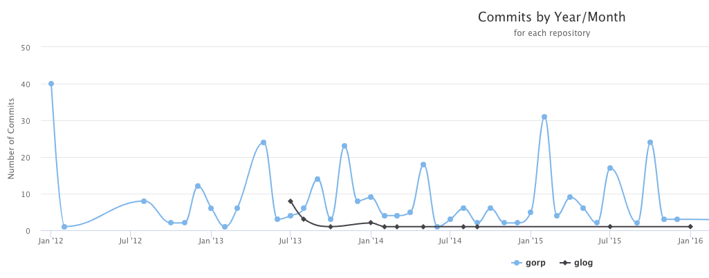
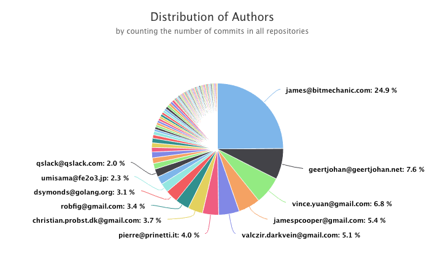

# Gitlog

[](https://travis-ci.org/mauleyzaola/gitlog)

Simple parsing of git repositories and get instant metrics in different formats.

The idea behind this project is make easy data transformation of the contents of git files, into more workable information.

Data output can come out in different formats such as JSON, DB Engines, XML and so forth. For the time being, only `html` and `json` are supported.

## Installation

```
go get -v github.com/gobuffalo/packr/v2/...
go get -v github.com/mauleyzaola/gitlog
dep ensure -v
packr2 install && packr2 clean
```

## Formats

### HTML Format

This is the default format and will execute from current working directory if no parameters are specified.

```bash
gitlog
```




### JSON Format
```
gitlog -format="json"
```
Result is a JSON array of repository objects. Each one contains its name and an array of commits (merges are excluded).
```
[{"name":"gitlog","commits":[{"hash":"0029751209fe88abe4080f241bd77fee5d0c16bd","author":{"name":"Mauricio Leyzaola","email":"mauricio.leyzaola@gmail.com"},"date":"2018-09-01T21:40:03-05:00","added":52,"removed":0},...
```

The `-dirs` parameter allows to process more than one git repository. You can pass any number of repositories. When using `html` format it might not be a good idea abuse this feature.

Path to repositories are local directories, and can be either absolute or relative. Directories must be separated by spaces like this.
```
gitlog -dirs=". ../glog $GOPATH/src/github.com/mauleyzaola/challenge"
```

Wildcards are also supported and `gitlog` will try to get as much information as possible. If for any reason it cannot accomplish the data retrieval, it will notify on stderr and continue working on the other directories.

```
gitlog -dirs="../tak* . ../challenge"
```

The result goes to stdout, so it can be used as stdin another program using pipes. For instance `jq` to pretty format the result.
```bash
gitlog -format="json" | jq .
[
  {
    "name": "gitlog",
    "commits": [
      {
        "hash": "0029751209fe88abe4080f241bd77fee5d0c16bd",
        "author": {
          "name": "Mauricio Leyzaola",
          "email": "mauricio.leyzaola@gmail.com"
        },
        "date": "2018-09-01T21:40:03-05:00",
        "added": 52,
        "removed": 0
      },
      ...

```

## Filters

### Authors

We can filter the commits by `author(s)` and by `date` range. Filters work as `AND` operators, so the more filters you add, the less results you will get in return

If we would want to filter by `author(s)` we can type in as many as needed, comma separated using the parameter `-authors` like this. Authors are identified by an exact match on the email.

```
gitlog -authors="gusdevel@outlook.com susan@mail.com"
```

### Date Range (from,to)

We can also restrict the commits by using a date range or just one date. The date format is `YYYYMMDD` and internaly gitlog will convert to the latest second of the day in UTC time.

```
gitlog -from="20180522"
gitlog -from="20180522" -to="20181031"
gitlog -to="20180101"
```

## Output

Passing a value to `-output` parameter Gitlog can compress the results into a zip file for easy distributing results.

```
gitlog -output="/Users/mau/Downloads/results.zip"
```