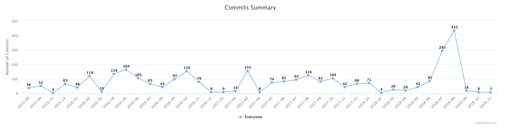

# Gitlog

[](https://travis-ci.org/mauleyzaola/gitlog)

Simple parsing of git repositories and get instant metrics in different formats.

The idea behind this project is make easy data transformation of the contents of git files, into more workable information.

So far, we are only focusing to output plain text without UI. This can change in the future.

Data output can come out in different formats such as JSON, DB Engines, XML and so forth.

## Installation
```
go get -u github.com/mauleyzaola/gitlog
```

## Examples

### HTML Output
```bash
gitlog
```


### JSON Output
```
gitlog -format="json"
```
Result is a JSON array of objects. Each one is a commit (merges are excluded)
```
[{"hash":"052453b347706cef9437eb79e703c0dc625e7bef","author":{"name":"mauleyzaola","email":"mauricio.leyzaola@gmail.com"},"date":"2018-09-14T00:44:32-05:00","comment":"#15 - consider full names for authors","added"...
```

You can point to another directory as well, just pass the path to the repository. 
It can be relative to your current path, or absolute, either will work. For instance, these would achieve the same result, considering you are at `$GOPATH/src/github.com`
```
gitlog -directory $GOPATH/src/github.com/golang/protobuf
```
```
gitlog -directory ../github.com/golang/protobuf
```
```
gitlog -directory golang/protobuf
```
```
gitlog -directory ./golang/protobuf
```

The result goes to stdout, so it can be used to input another program. For instance `jq` to pretty format the result.
```bash
gitlog -format json | jq .
             [
               {
                 "hash": "052453b347706cef9437eb79e703c0dc625e7bef",
                 "author": {
                   "name": "mauleyzaola",
                   "email": "mauricio.leyzaola@gmail.com"
                 },
                 "date": "2018-09-14T00:44:32-05:00",
                 "comment": "#15 - consider full names for authors",
                 "added": 5,
                 "removed": 5
               },
               ...

```
