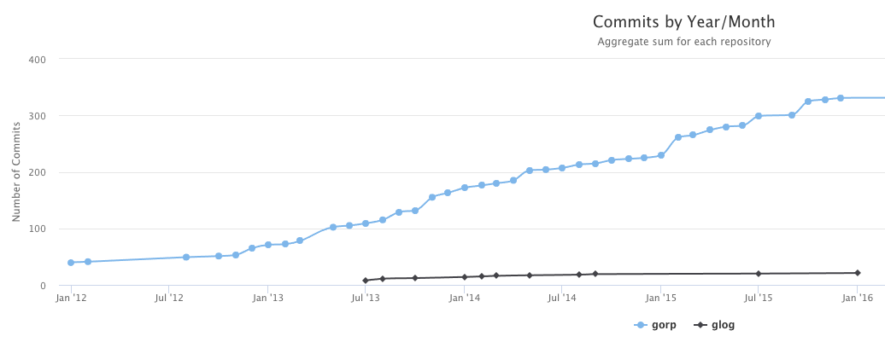

# Gitlog


Simple parsing of git repositories and get instant metrics in different formats.

The idea behind this project is make easy data transformation of the contents of git files, into more workable information.

Data output can come out in different formats such as JSON, DB Engines, XML and so forth. For the time being, only `html` and `json` are supported.

## Installation

```
go install github.com/mauleyzaola/gitlog@latest
```

## Formats

### HTML Format

This is the default format and will execute from current working directory if no parameters are specified.

```bash
gitlog report
```




You can provide more that one directory, gitlog will try to find any git directories based on those parameters you provide

```bash
gitlog report ~/go/src/github.com/mauleyzaola/gitlog .
```

Also wildcards are allowed

```bash
gitlog report *
```


### JSON Format
```
gitlog report --format="json"
```
Result is a JSON array of repository objects. Each one contains its name and an array of commits (merges are excluded).
```
[{"name":"gitlog","commits":[{"hash":"0029751209fe88abe4080f241bd77fee5d0c16bd","author":{"name":"Mauricio Leyzaola","email":"mauricio.leyzaola@gmail.com"},"date":"2018-09-01T21:40:03-05:00","added":52,"removed":0},...
```

The result goes to stdout, so it can be used as stdin another program using pipes. For instance `jq` to pretty format the result.
```bash
gitlog report --format="json" | jq .
[
  {
    "name": "gitlog",
    "commits": [
      {
        "hash": "0029751209fe88abe4080f241bd77fee5d0c16bd",
        "author": {
          "name": "Mauricio Leyzaola",
          "email": "mauricio.leyzaola@gmail.com"
        },
        "date": "2018-09-01T21:40:03-05:00",
        "added": 52,
        "removed": 0
      },
      ...

```

## Filters

### Authors

We can filter the commits by `author(s)` and by `date` range. Filters work as `AND` operators, so the more filters you add, the less results you will get in return

If we would want to filter by `author(s)` we can type in as many as needed, comma separated using the parameter `-authors` like this. Authors are identified by an exact match on the email.

```
gitlog report -authors="gusdevel@outlook.com susan@mail.com"
```

### Date Range (from,to)

We can also restrict the commits by using a date range or just one date. The date format is `YYYYMMDD` and internaly gitlog will convert to the latest second of the day in UTC time.

```
gitlog report -from="20180522"
gitlog report -from="20180522" -to="20181031"
gitlog report -to="20180101"
```
